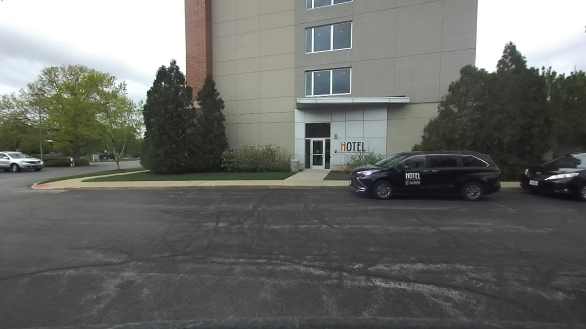

# Depth Fusion Visual SLAM

# Introduction
we present a depth fusion visual SLAM that enables stable SLAM in outdoor scenes using color and depth inputs. Our approach consists of a depth prediction architecture to enhance depth information and a SLAM architecture for tracking and map creation. We design a depth fusion technique to combine estimated depth with captured depth, refining the depth information. To improve and stabilize tracking, we introduce a tracker model filter that uses two quaternion parameters instead of nine rotation matrix parameters. We also develop a weighted sample module to filter irrelevant information for tracking. Our method is implemented on our own dataset, collected using a ZED 2 camera.


# Install and run
## Setup
To setup the environment:
```bash
sudo apt-get install libopenexr-dev
    
conda env create -f environment.yaml
conda activate DFVSlam
```
## Run
To run the Depth Fusion Visual SLAM, run the following command, change the yaml according to your config:
```bash
python -W ignore run.py configs/Highbay/parking.yaml
```

## Dataset
We implement our method on collected outdoor RosBag through ZED 2 camera. To extract images from Rosbag, run the script:
```bash
python rosbag2image.py
```
You need to modify the rosbag name, topic name accordingly. using ***generateAllFrame*** to extract alll information. Using ***shuffleData*** to shuffle training and testing dataset for finetune [DeepPruner](https://github.com/uber-research/DeepPruner) model. Using ***sampleData*** to generate data for Depth fusion Visual SLAM.

Data Structure:
  > DataSet \
  > |----- Left RGB Image \
  > |----- Depth Image 

Sample of left RGB data:




